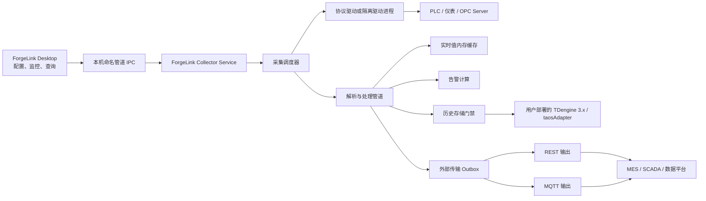
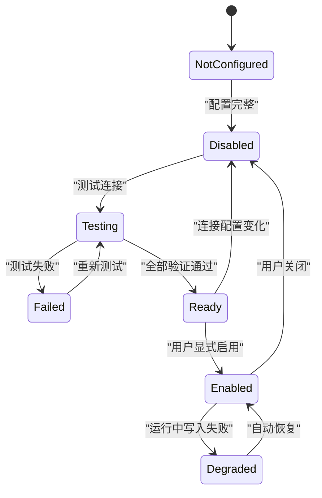
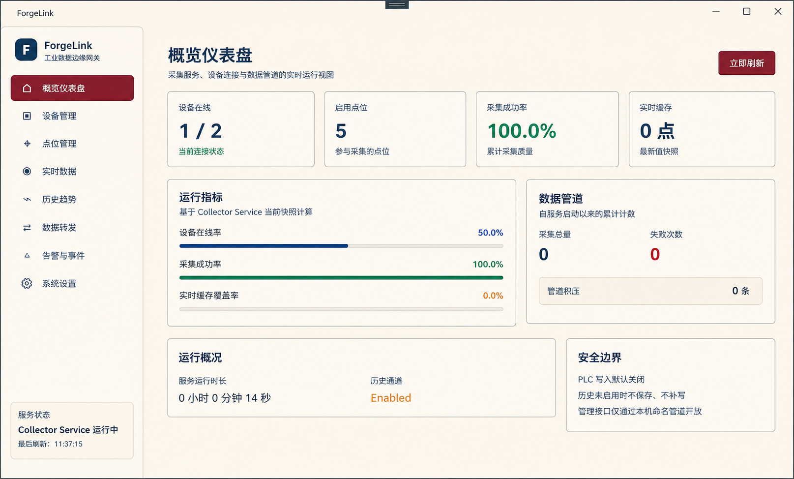
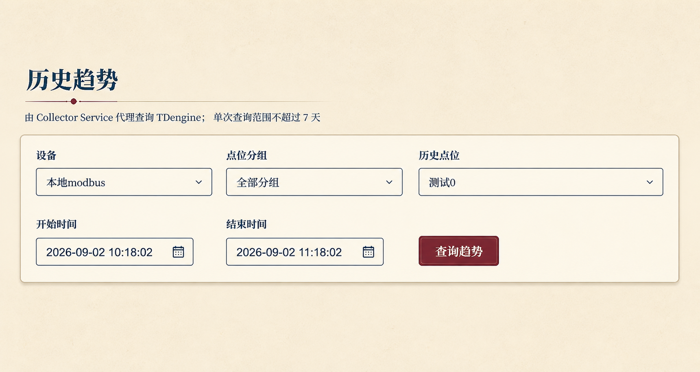

# ForgeLink 系统总体设计方案

## 文档信息

| 项目 | 内容 |
| --- | --- |
| 系统名称 | ForgeLink PLC 数据采集与转发系统 |
| 文档类型 | 系统总体设计方案 |
| 方案状态 | 实施中（设计与进度统一基线） |
| 目标平台 | Windows x64 工控机或边缘计算机 |
| 主要开发语言 | C# |
| 目标框架 | .NET 10 LTS |
| 本地配置数据库 | SQLite |
| 点位历史数据库 | 用户自行部署的 TDengine 3.x |
| 当前联调基线 | TDengine 3.4.2.6 Enterprise，Windows EXE，`D:\TDengine`，WebSocket `127.0.0.1:6041` |
| 进度更新时间 | 2026-09-02 |

本文描述 ForgeLink 的产品边界、总体架构、核心模块、数据存储、外部接口、可靠性、安全、部署和验收要求。Visual Studio 安装不属于本文范围，参见独立文档《Visual Studio 2026 安装指导》。

### 进度标记说明

- `[x]`：代码实现完成，并通过当前可用的本地自动化或进程冒烟验证；
- `[~]`：部分实现，或实现完成但仍缺少现场/目标系统联调；
- `[ ]`：尚未实施；
- `[!]`：已确认范围调整，不再按原方案实施。

静态检查、模拟器测试和本机进程冒烟不等同于真实 PLC、TDengine 或生产环境验收。各阶段明细统一维护在第 23 节。

### 已确认的实施基线调整

1. Desktop 与 Collector Service 仅使用 Windows 命名管道 `ForgeLink.Collector` 通信；ASP.NET Core Minimal API 路由语义保留在管道之上，不再监听 `127.0.0.1:5088` TCP 端口；
2. 首批 PLC 协议只实现 Modbus TCP，具体 PLC 型号待定；协议报文使用 NModbus，不手写原生 Modbus TCP 驱动；
3. 历史数据库由原 InfluxDB 3.x 方案调整为只实现 TDengine 3.x，使用官方 `TDengine.Connector` 3.2.1 和 WebSocket 连接；本机基线为 3.4.2.6 Enterprise Windows 安装版，部署目录 `D:\TDengine`；原 InfluxDB 适配器、依赖及专用概念已移除；
4. 当前配置访问直接使用 `Microsoft.Data.Sqlite` 参数化 SQL，未引入 Dapper；
5. 当前测试使用 xUnit，未引入 FluentAssertions 和 NSubstitute；需要时再评估，避免无实际用途的依赖。

## 1. 项目背景

ForgeLink 是一套以 C# 为主的轻量级 PLC 数据采集系统，用于连接工业现场的 PLC、仪表或 OPC Server，读取寄存器及变量数据，完成数据解析、质量判断、工程值换算和字段映射，并将数据可靠地传输给 MES、SCADA、数据平台或其他外部系统。

系统以单机部署为第一目标，安装后不要求用户手动配置 .NET Runtime、SQLite、Docker、Java、Node.js 或其他运行环境。TDengine 作为可选的外部历史数据库，由用户自行安装和维护；未配置并启用 TDengine 时，ForgeLink 不保存点位采集历史值。ForgeLink 客户端固定使用 WebSocket，不要求工控机安装 TDengine Native 客户端驱动。

## 2. 建设目标

### 2.1 功能目标

- 支持多个 PLC 或工业设备连接；
- 支持设备、点位、采集周期和数据类型配置；
- 支持实时值采集、显示和质量判断；
- 支持数值缩放、偏移、字节序和字序处理；
- 支持实时数据向外部系统转发；
- 支持 REST 和 MQTT 输出通道；
- 支持可选 TDengine 历史写入和历史查询；
- 支持断线重连、失败重试、状态监控和诊断导出；
- 支持 Windows Service 后台运行；
- 支持图形化桌面管理和监控。

### 2.2 非功能目标

- 轻量化：默认不依赖本机数据库服务或容器环境；
- 稳定性：桌面程序退出不影响采集；
- 可维护性：协议、历史库和传输通道均采用适配器结构；
- 安全性：凭据加密、最小权限、写 PLC 默认关闭；
- 可诊断性：连接、采集、队列、写入和磁盘状态可观测；
- 可升级性：配置数据库支持版本化迁移和升级前备份；
- 可扩展性：后续可增加 PLC 协议、外部通道和历史数据库实现。

### 2.3 非目标

首版不以以下能力为建设目标：

- 不内置或静默安装 TDengine Server 或 taosAdapter；
- 不建设中心化多租户云平台；
- 不替代完整 SCADA 或 MES；
- 不默认提供 PLC 编程和复杂控制逻辑；
- 不默认直接写入外部业务数据库；
- 不使用 SQLite 保存点位采集历史；
- 不保证 TDengine 长时间离线时历史数据零丢失；
- 不默认支持跨操作系统桌面客户端。

## 3. 核心设计原则

1. 采集服务与桌面 UI 分离；
2. 协议实现与业务逻辑分离；
3. 实时处理、历史存储和外部传输相互解耦；
4. SQLite 仅承担本地管理数据，不承担历史时序存储；
5. TDengine 未配置、未验证或未启用时不保存历史；
6. 外部通道失败不能阻塞 PLC 采集线程；
7. 所有高频处理使用异步、有界队列和批量操作；
8. 采集失败不能被伪装成数值零；
9. PLC 写入功能默认禁用；
10. 系统升级不得静默删除用户配置、日志或历史数据库中的数据。

## 4. 总体架构



## 5. 运行进程

### 5.1 ForgeLink Collector Service

Windows Service，负责：

- PLC 连接和生命周期管理；
- 点位采集调度；
- 数据类型解析和工程值换算；
- 实时值内存缓存；
- 告警规则计算；
- TDengine 历史写入和查询代理；
- 外部消息生成和转发；
- 日志、指标和健康状态；
- 向桌面端提供本机管理接口。

该服务开机自动启动，不依赖桌面程序是否运行。

### 5.2 ForgeLink Desktop

WPF 桌面程序，负责：

- 系统概览；
- 设备和点位配置；
- 实时值监控；
- 历史趋势查询；
- TDengine 和外部通道配置；
- 告警、事件、队列和日志查看；
- 诊断包导出；
- 启停采集组及受控管理操作。

Desktop 不直接连接 PLC、不直接访问 TDengine，也不直接写入 SQLite。所有操作通过 Collector Service 完成。

### 5.3 ForgeLink DriverHost

可选隔离进程，用于以下驱动：

- 仅提供 x86 DLL 的厂商 SDK；
- 依赖旧版 .NET Framework 的 SDK；
- 依赖原生 C/C++ 组件的 SDK；
- 稳定性无法保证或可能导致进程崩溃的驱动。

DriverHost 通过本机 IPC 与 Collector Service 通信。单个驱动进程故障不应导致主服务退出。

## 6. 推荐技术栈

| 层次 | 技术选择 |
| --- | --- |
| 运行框架 | .NET 10 LTS、C# |
| 桌面 UI | WPF、XAML、WPF UI |
| UI 架构 | CommunityToolkit.Mvvm、MVVM |
| 后台服务 | ASP.NET Core Host、Hosted Service、Windows Service 托管 |
| 本机通信 | 命名管道 IPC |
| 配置数据库 | SQLite、Microsoft.Data.Sqlite 参数化 SQL |
| 高并发管道 | System.Threading.Channels |
| HTTP 接口 | ASP.NET Core Minimal API |
| MQTT | MQTTnet |
| TDengine 3.x | TDengine.Connector 3.2.1（WebSocket） |
| 日志 | Microsoft.Extensions.Logging、Serilog |
| 可观测性 | Health Checks、OpenTelemetry |
| 图表 | LiveCharts2 或 ScottPlot，实施阶段压测选定 |
| 测试 | xUnit；按真实需要再引入断言或替身库 |
| 安装 | WiX Toolset 引导安装包 |

## 7. 功能模块

### 7.1 系统概览

- 服务运行状态；
- PLC 总数、在线数和异常数；
- 启用点位数和采集成功率；
- 每秒采集值数量；
- TDengine 状态；
- 外部转发状态；
- 队列积压；
- 最近告警；
- CPU、内存、磁盘和运行时长。

### 7.2 设备管理

设备配置至少包含：

- 设备 ID、名称和描述；
- 协议类型；
- IP、端口、站号或串口参数；
- 连接超时和读取超时；
- 重连策略；
- 默认采集周期；
- 是否启用；
- 所属站点或分组；
- 驱动专用配置；
- 最后一次连接测试结果。

### 7.3 点位管理

点位配置至少包含：

- 稳定点位 ID；
- 点位编码、名称和描述；
- 所属设备和采集组；
- 协议地址；
- 数据类型；
- 字节序和字序；
- 字符串长度与编码；
- 缩放系数、偏移量和单位；
- 合法值范围；
- 采集周期；
- 死区值；
- 历史记录模式；
- 外部字段映射；
- 是否启用；
- 是否允许写入。

支持 CSV 导入、CSV 导出、批量编辑、复制点位和配置校验。

### 7.4 实时数据

- 当前工程值和原始值；
- 数据质量；
- PLC 源时间；
- ForgeLink 采集时间；
- 最后更新时间；
- 设备连接状态；
- 分组、搜索和过滤；
- 刷新频率限制；
- 实时趋势；
- 复制和导出当前快照。

### 7.5 历史趋势

- 从 Collector Service 查询 TDengine；
- 按设备、点位和时间范围查询；
- 多点位曲线对比；
- 自动降采样；
- 显示数据质量和缺口；
- 查询取消和超时；
- CSV 导出；
- TDengine 不可用时明确提示，不回退 SQLite。

### 7.6 外部转发

- REST 批量推送；
- MQTT 发布；
- 字段映射；
- 路由条件；
- 批量大小和发送周期；
- 重试、死信和人工重发；
- 消息 ID 和幂等键；
- Token、证书和 TLS 配置；
- 连接测试和发送测试。

### 7.7 告警和事件

- 设备离线；
- 采集超时；
- 数值越限；
- 数据长期未更新；
- TDengine 写入故障；
- 外部传输持续失败；
- 内存历史队列溢出；
- Outbox 积压；
- 磁盘空间不足；
- 服务和驱动异常退出。

## 8. PLC 协议设计

### 8.1 首批协议

| 优先级 | 协议 | 说明 |
| --- | --- | --- |
| P0（已确认） | Modbus TCP | 首批唯一协议；使用 NModbus；具体 PLC 型号待定 |
| 后续候选 | OPC UA Client | OPC Server 和现代工业设备 |
| 后续候选 | Siemens S7 TCP | 西门子 S7 系列 |
| 后续候选 | Modbus RTU | 串口设备 |
| 后续候选 | Mitsubishi MC | 三菱 PLC |
| 后续候选 | Omron FINS | 欧姆龙 PLC |

后续候选协议不在首版范围内；是否实施及优先级必须由实际设备和业务需求重新确认。协议实现优先采用维护中的现有库或厂商 SDK，不手写原生报文栈。

### 8.2 驱动抽象

```csharp
public interface IPlcDriver
{
    Task ConnectAsync(CancellationToken cancellationToken);
    Task DisconnectAsync(CancellationToken cancellationToken);
    Task<DriverHealth> CheckHealthAsync(CancellationToken cancellationToken);

    Task<IReadOnlyList<TagValue>> ReadAsync(
        IReadOnlyList<TagDefinition> tags,
        CancellationToken cancellationToken);

    Task WriteAsync(
        IReadOnlyList<TagWriteRequest> requests,
        CancellationToken cancellationToken);
}
```

业务层不得直接引用具体协议库类型。

### 8.3 调度和连接策略

- 按设备、连接和采集周期建立采集组；
- 连续地址尽可能合并读取；
- 同一 PLC 默认串行读写；
- 不同 PLC 可并行采集；
- 每个请求必须支持超时和取消；
- 连续失败达到阈值后重建连接；
- 重连采用指数退避和随机抖动；
- 单个慢设备不得占满全局工作线程；
- 采集队列必须有界；
- 连接恢复后自动恢复对应采集组。

### 8.4 数据质量

```text
Good
Uncertain
Bad
Timeout
Disconnected
ParseError
OutOfRange
Stale
```

异常状态不得自动转换为 `0`。实时值、历史值和外发数据均应携带质量状态。

## 9. 数据处理管道

```text
PLC 原始字节
→ 协议解析
→ 数据类型转换
→ 字节序与字序处理
→ 缩放与偏移
→ 合法性检查
→ 数据质量计算
→ 实时值更新
→ 告警计算
→ 历史策略判断
→ 外部字段映射
→ 外部发送队列
```

标准点位值模型包含：

```text
InstanceId
DeviceId
PointId
RawValue
EngineeringValue
DataType
Unit
Quality
SourceTimestampUtc
CollectTimestampUtc
SequenceNumber
```

## 10. SQLite 设计

### 10.1 职责边界

SQLite 只保存：

- 设备、点位和采集组配置；
- TDengine 连接配置和门禁状态；
- 外部通道和字段映射；
- 告警规则；
- 系统设置；
- 用户和权限；
- 操作审计；
- 服务事件；
- 外部传输 Outbox 和死信；
- 数据库迁移版本。

SQLite 不保存：

- 点位采集历史；
- 历史分钟、小时或日汇总；
- TDengine 查询结果缓存；
- TDengine 未启用期间的待补写历史；
- TDengine 故障期间的持久化历史缓冲。

### 10.2 数据库文件

```text
C:\ProgramData\ForgeLink\
├─ config\forgelink-config.db
└─ runtime\forgelink-runtime.db
```

配置库和运行库分离，降低高频运行状态写入对配置管理的影响。

### 10.3 Outbox 边界

外部传输 Outbox 可以短期包含等待外部系统确认的业务消息，但它不是历史数据库：

- 不提供点位趋势查询；
- 发送成功后按策略删除；
- 设置最大容量和保留时间；
- 历史模块不得读取 Outbox；
- 系统应在 UI 中将“历史缺口”和“转发积压”明确区分。

如果未来提出“任何采集值均不得出现在 SQLite 文件”的安全要求，应将 Outbox 调整为内存或独立文件队列。

## 11. TDengine 历史通道

### 11.1 定位

- TDengine 是唯一点位历史数据库；
- 用户自行部署和维护 TDengine 3.x 及其 WebSocket 接入服务 taosAdapter；
- ForgeLink 安装包不包含 TDengine 或 taosAdapter；
- 未配置、未验证或未启用时不保存历史；
- TDengine 故障时不回退 SQLite；
- 历史查询由 Collector Service 代理。

### 11.2 TDengine 3.x 适配

```csharp
public interface IHistoryChannel
{
    Task<HistoryChannelTestResult> TestAsync(
        CancellationToken cancellationToken);

    Task<HistoryWriteResult> WriteAsync(
        IReadOnlyList<HistoryValue> values,
        CancellationToken cancellationToken);

    Task<HistoryQueryResult> QueryAsync(
        HistoryQuery query,
        CancellationToken cancellationToken);
}
```

实现：

```text
DisabledHistoryChannel
TDengineHistoryChannel
```

首版仅支持 TDengine 3.x，固定通过官方连接器的 WebSocket 模式访问 taosAdapter，不实现 Native 连接。业务层只依赖 `IHistoryChannel`，不得引入 TDengine 客户端专用类型。

版本兼容策略：

- `3.3.6.0` 及以上：使用 C# Connector `3.1.7` 及以上时属于官方 WebSocket 兼容保证范围；当前固定 Connector `3.2.1`；
- `3.0.0.0` 至 `3.3.5.x`：只使用 3.0 已具备的超级表、子表、基础 INSERT/SELECT 等能力，作为尽力兼容范围；每个目标版本必须完成建表、批量写入和查询验收后才能启用；
- 低于 `3.0.0.0`、无法识别版本或读写测试失败：历史门禁拒绝启用；
- 不使用 BLOB、DECIMAL、虚拟表、Adapter HA 自动发现等较新版本特性作为首版依赖；
- 当前本机 TDengine `3.4.2.6.enterprise` 位于官方保证范围内。

### 11.3 配置项

通用配置：

- WebSocket 主机或多地址列表；
- WebSocket 端口，默认 `6041`；
- 用户名和密码；
- Database；
- TLS 开关和证书验证；
- WebSocket 压缩和自动重连；
- 请求超时；
- 批量写入条数；
- 批量刷新间隔；
- 最大内存缓冲；
- 自动重连策略；
- 查询最大时间范围；
- 全局历史存储开关。

当前本机开发基线为 `Host=127.0.0.1`、`Port=6041`、`UseSsl=false`；TDengine 安装目录只用于运维诊断，不写入连接字符串，也不得形成对 `D:\TDengine` 的运行时文件依赖。

密码使用 Windows DPAPI 加密，不允许出现在普通日志、诊断包或明文配置导出中。连接器 3.2.1 支持多地址故障转移，但首版不依赖 3.2.2 才新增的 taosAdapter HA 自动发现。

### 11.4 门禁状态



连接测试必须验证：

1. 主机、端口和 WebSocket 连接类型有效；
2. 网络可达；
3. TLS 验证通过；
4. 用户名和密码认证成功；
5. Database 存在；
6. 账号具有创建超级表和子表的权限；
7. 账号具有写入和查询权限；
8. 测试子表和测试点写入成功；
9. 测试点查询成功且测试子表可清理；
10. 服务端版本与所选连接器兼容。

只有全部通过后才允许启用。服务器地址、端口、账号、Database 或 TLS 配置变化后，自动关闭历史通道并要求重新测试。

### 11.5 未启用时的行为

- PLC 继续采集；
- 实时值继续显示；
- 告警继续计算；
- 外部转发继续运行；
- 不创建历史记录；
- 不积累等待未来补写的数据；
- 历史页面显示“历史存储未启用”；
- 后续启用时不补写此前数据。

### 11.6 故障缓冲

TDengine 临时不可用时采用有界内存缓冲，不进行本地持久化：

| 参数 | 默认值 |
| --- | ---: |
| 最大缓冲值数量 | 100,000 |
| 最长缓冲时间 | 10 分钟 |
| 批量写入条数 | 1,000 |
| 批量刷新间隔 | 1 秒 |
| 初始重试间隔 | 2 秒 |
| 最大重试间隔 | 60 秒 |

内存缓冲耗尽时：

- 丢弃最旧历史值；
- 记录丢弃数量；
- 记录缺口起止时间；
- 产生醒目告警；
- 不回退 SQLite；
- 服务重启后未写入的内存数据允许丢失。

如未来要求长时间离线仍不丢历史，应另行设计非 SQLite 的持久化缓冲，不属于当前基线。

### 11.7 历史记录模式

每个点位可以选择：

```text
不记录
每次采集记录
值变化时记录
超过死区时记录
固定周期快照
变化记录并周期心跳
```

历史提交条件：

```text
全局历史存储已启用
AND TDengine 通道可写
AND 点位启用了历史记录
AND 当前值符合记录模式
AND 当前数据质量符合保存规则
```

默认建议采用“超过死区时记录，并每 60 秒至少记录一次心跳值”。异常质量值默认保存，以反映断线、超时和数据无效区间。

### 11.8 超级表和子表设计

为避免不同数据类型共享列时发生类型冲突，按值类型划分五个超级表：

```text
plc_numeric
plc_integer
plc_boolean
plc_text
plc_event
```

每个点位在每种值类型下使用一个确定性子表，例如 `plc_numeric_{pointId:N}`。子表 Tags：

```text
instance_id
device_id
point_id
```

数据列：

```text
value
raw_value
data_type
unit
quality
source_timestamp
collect_timestamp
sequence_number
```

约束：

- 主时间戳 `ts` 使用 UTC 采集时间的 Unix 毫秒值；
- PLC 源时间作为独立字段保存；
- `point_id` 使用不可变稳定 ID；
- 点位显示名称不作为唯一标识；
- `instance_id`、`device_id`、`point_id` 只作为子表 Tags，不随采样变化；
- `quality`、`unit` 和 `data_type` 作为数据列，异常且无值的记录进入 `plc_event`，不得伪造为零；
- 写入按最多 1,000 条分批，同一子表的多行在一个 INSERT 段中合并；
- SQL 标识符只允许内部生成或通过白名单校验，字符串字面量统一转义。

## 12. 外部系统传输

### 12.1 REST

- 支持 HTTP/HTTPS；
- 支持批量 JSON；
- 支持 Header、Bearer Token 和客户端证书；
- 支持连接测试；
- 支持超时、重试和死信；
- 支持响应确认和幂等键。

### 12.2 MQTT

- 支持 MQTT 3.1.1 和 MQTT 5；
- 支持 TCP、TLS 和 WebSocket；
- 支持 QoS 配置；
- 支持主题模板；
- 支持客户端 ID、用户名、密码和证书；
- 支持自动重连和离线状态监控。

### 12.3 Outbox

```text
采集值完成处理
→ 创建外发消息
→ 写入 Outbox
→ 后台批量发送
→ 外部系统确认
→ 标记成功
→ 到期清理
```

消息至少包含：

- 唯一消息 ID；
- ForgeLink 实例 ID；
- 路由 ID；
- 设备和点位标识；
- 数据时间范围；
- 创建时间；
- 重试次数；
- 数据条数；
- 负载校验值。

处理规则：

- 网络错误、超时和 HTTP 5xx 自动重试；
- HTTP 401/403 暂停通道并告警；
- 不可恢复的请求错误进入死信；
- 重试采用指数退避和随机抖动；
- 队列达到阈值必须告警；
- 不允许静默丢弃待发送数据。

## 13. 桌面 UI 设计

### 13.1 视觉风格

- 默认采用“普鲁士蓝 + 奶杏 + 酒红”的明亮复古工业主题，在现代信息架构上增加克制的复古撞色，不使用拟物化装饰；
- 普鲁士蓝承担品牌、标题、图标、链接、表格强调和趋势线，奶杏承担应用画布、侧栏、卡片与输入表面，酒红承担当前导航、主要操作、选中态和焦点强调；
- 正文继续使用适合桌面软件的现代无衬线字体，不在实际界面中使用装饰性衬线或书法字体；
- 统一设计变量、4–6 px 圆角、间距和轻量阴影，卡片与弹窗保持完全不透明；只有模态遮罩允许使用半透明深色蒙层；
- 动画克制，不影响实时监控；
- 状态同时使用颜色、文字和图标表达；
- 所有表单控件使用 UI 框架提供的控件；
- 下拉弹层、焦点态、校验态与主题一致；
- 支持 100%、125% 和 150% DPI。

主题设计令牌如下，业务页面不得直接复制色值：

| 角色 | 色值 | 使用范围 |
| --- | --- | --- |
| 普鲁士蓝 | `#123B52` | 品牌标识、页面标题、导航图标、链接、趋势线、普通进度条 |
| 酒红 | `#7A263A` | 当前导航、主要操作、选中态、焦点与关键强调 |
| 奶杏画布 | `#F8F0E1` | 应用主背景 |
| 奶杏侧栏 | `#FBF4E7` | 标题栏、侧边导航与外层容器 |
| 象牙卡片 | `#FFF9EE` | 卡片、表单、表格、弹窗和下拉弹层 |
| 冷白输入表面 | `#F7FAF8` | 文本框、密码框、下拉框和日期时间输入区；与暖色容器形成可识别层级 |
| 深色正文 | `#24323D` | 主要正文与数据 |
| 弱化文字 | `#68737A` | 描述、标签和辅助信息 |
| 暖灰边框 | `#CFC2AC` | 卡片、表格、输入框与分隔线 |
| 成功 / 警告 / 危险 | `#087F5B` / `#B96A00` / `#B42332` | 只表达真实业务状态，不被主题强调色替代 |

以下原型图用于确认颜色层级、表面关系和强调色比例；实际实现以统一资源字典、控件可读性和 DPI 适配为准，不要求逐像素复刻图片纹理。



*图 13-1　概览仪表盘主题指导：酒红用于当前导航和主操作，普鲁士蓝用于品牌与信息层级。*



*图 13-2　历史趋势主题指导：奶杏表面、普鲁士蓝边框与酒红操作形成克制撞色；实际产品保持无衬线字体。*

### 13.2 页面结构

```text
概览仪表盘
设备管理
点位管理
实时数据
历史趋势
数据转发
告警与事件
任务与队列
运行日志
系统设置
关于与诊断
```

桌面端采用“应用壳层 + 独立页面 + 页面 ViewModel”结构：

- `MainWindow` 只负责标题栏、一级菜单、服务状态和当前内容宿主；
- 一级菜单使用强类型 `AppRoute`，不得使用页面名称字符串和成组 `Visibility` 切换；
- 每个菜单页面使用独立 `UserControl` 和 ViewModel，并通过 DataTemplate 映射；
- 设备和点位编辑器使用独立 View 和编辑器 ViewModel；
- 页面通过 `INavigationAware` 接收进入和离开事件，离开实时页面时必须停止刷新；
- 系统状态由单一共享监视器刷新，设备和点位进入页面时加载，历史数据按用户查询加载；
- 页面只依赖 `ICollectorApiClient`，不得直接连接 PLC、TDengine 或 SQLite；
- 当前阶段保持单一 `ForgeLink.Desktop` 项目，只有出现跨应用复用需求时才拆分独立控件程序集。

### 13.3 性能要求

- UI 不直接消费每一个采集事件；
- 实时表格按可配置频率批量刷新；
- 图表数据进入 UI 前进行抽样；
- 大量点位使用虚拟化列表；
- 历史查询和导出支持取消；
- UI 卡顿不得影响采集服务。

## 14. 安全设计

- PLC 写入默认关闭；
- 写点位使用白名单；
- 写操作需要权限、二次确认和审计；
- 服务管理接口仅通过本机命名管道开放，不监听 TCP 管理端口；
- 命名管道使用 Windows ACL；开发版允许本机 Users 组读写，安装阶段需结合服务账户和操作员组收紧并验收；
- 外部连接优先使用 TLS；
- 密码和 Token 使用 Windows DPAPI；
- SQLite 文件使用 NTFS ACL；
- 不在日志中记录密码、Token 和完整连接串；
- OPC UA 使用证书信任机制；
- 未知 OPC UA 证书不得自动永久信任；
- 配置导出默认排除敏感凭据；
- 服务使用最小权限账户；
- 远程管理必须显式启用并配置认证。

## 15. 日志、监控与诊断

### 15.1 日志分类

- 系统日志；
- 设备连接日志；
- 采集日志；
- 数据转换日志；
- TDengine 写入和查询日志；
- 外部传输日志；
- 用户操作审计；
- 安装和升级日志。

### 15.2 核心指标

```text
设备在线数
采集成功率
每秒采集值数量
平均和最大采集耗时
点位数据延迟
TDengine 写入成功率
TDengine 内存缓冲长度
历史丢弃数量
历史缺口范围
Outbox 积压数量
外部发送成功率
驱动重连次数
CPU 和内存使用率
磁盘剩余空间
服务运行时长
```

### 15.3 诊断包

一键诊断包包含：

- 软件和运行时版本；
- 操作系统摘要；
- 配置摘要；
- 最近日志；
- 设备状态；
- TDengine 状态；
- 外部通道状态；
- 队列状态；
- 网络测试结果。

诊断包必须清除密码、Token、私钥和其他敏感信息。

## 16. 本地目录

```text
C:\Program Files\ForgeLink\
├─ ForgeLink.Desktop.exe
├─ ForgeLink.Collector.Service.exe
├─ drivers\
└─ application files

C:\ProgramData\ForgeLink\
├─ config\
│  └─ forgelink-config.db
├─ runtime\
│  └─ forgelink-runtime.db
├─ logs\
├─ backup\
├─ certificates\
├─ drivers\
└─ diagnostics\
```

程序目录只读，运行数据统一写入 `ProgramData`。

## 17. 安装与运行环境

### 17.1 发布模式

ForgeLink 采用 framework-dependent 发布，安装程序自动检测并安装所需 .NET 10 Runtime。

需要：

- Microsoft.WindowsDesktop.App 10.0.x x64；
- Microsoft.AspNetCore.App 10.0.x x64。

不安装 .NET SDK，不要求目标机器安装 Visual Studio。

### 17.2 安装包

主交付物为完整离线安装包：

```text
ForgeLink-Full-Setup.exe
├─ ForgeLink Desktop
├─ ForgeLink Collector Service
├─ .NET Desktop Runtime 10 x64
├─ ASP.NET Core Runtime 10 x64
├─ SQLite 原生依赖
└─ 安装和升级组件
```

可选提供在线轻量安装包，由安装程序在缺少 Runtime 时从微软下载。工厂现场以离线安装包为主。

### 17.3 安装行为

- 检测操作系统和 x64 架构；
- 检测两个 .NET 10 Runtime；
- 缺失时自动安装；
- 创建程序目录和数据目录；
- 初始化 SQLite 配置库；
- 安装并启动 Windows Service；
- 设置目录 ACL；
- 创建开始菜单和桌面快捷方式；
- 注册卸载和修复入口；
- 记录安装日志；
- 升级前备份配置数据库。

### 17.4 服务账户

建议使用受限的 Windows 服务虚拟账户：

```text
NT SERVICE\ForgeLinkCollector
```

仅授予 ForgeLink 数据目录、所需串口和 PLC 网络访问权限，不默认使用 LocalSystem。

### 17.5 卸载行为

- 默认删除程序文件和服务；
- 默认保留配置、日志和备份；
- 彻底删除数据必须由用户单独确认；
- 卸载 ForgeLink 不卸载共享的 .NET Runtime；
- 不修改或删除用户的 TDengine 服务及非 ForgeLink 数据。

## 18. 配置、备份与升级

- 配置保存前执行合法性校验；
- 配置具有版本号；
- 支持配置导入和导出；
- 导入前自动备份；
- 数据库升级采用版本化迁移；
- 升级失败时恢复配置库备份；
- 配置导出不包含明文密码；
- 修改关键连接配置需要重新测试；
- 服务升级期间正确停止采集并等待当前批次结束；
- 升级完成后检查服务、SQLite 和驱动状态。

## 19. 解决方案结构

截至 2026-08-21，实际解决方案结构如下；尚未创建的模块不预先放置空项目：

```text
ForgeLink.slnx
├─ src
│  ├─ ForgeLink.Domain
│  ├─ ForgeLink.Application
│  ├─ ForgeLink.Protocols.Abstractions
│  ├─ ForgeLink.Protocols.Modbus
│  ├─ ForgeLink.Infrastructure
│  ├─ ForgeLink.Persistence.Sqlite
│  ├─ ForgeLink.History.Abstractions
│  ├─ ForgeLink.History.TDengine
│  ├─ ForgeLink.Collector.Service
│  └─ ForgeLink.Desktop
├─ tests
│  ├─ ForgeLink.Domain.Tests
│  ├─ ForgeLink.Application.Tests
│  ├─ ForgeLink.Protocol.Tests
│  ├─ ForgeLink.History.Tests
│  └─ ForgeLink.Desktop.Tests
├─ docs
└─ tools
```

阶段四按需新增 `Transport.Abstractions`、`Transport.Rest` 和 `Transport.Mqtt`；阶段五按需新增 `DriverHost`、安装器及独立集成测试项目。OPC UA、Siemens S7 等协议不属于已确认的首批范围。

## 20. 编程规范

### 20.1 总体原则

- 代码以清晰、稳定和可维护为优先，不为形式上的抽象增加无实际价值的层级；
- 遵循单一职责、依赖倒置和接口隔离原则；
- 协议、历史存储、外部传输、持久化和 UI 之间通过明确接口隔离；
- 领域层和应用层不得依赖具体 UI、数据库或 PLC 协议实现；
- 同类功能应提取公共服务、组件、转换器或工具，不复制粘贴业务逻辑；
- 公共能力进入共享模块前，应确认至少存在两个真实使用场景，避免过早抽象；
- 新增功能应优先扩展现有接口和组件，不重复创建功能相近的实现；
- 不允许使用全局可变状态保存设备连接、实时值或运行配置；
- 所有资源、连接、订阅和后台任务必须具有明确的创建、取消和释放路径。

### 20.2 可复用性要求

以下能力应设计为可替换、可复用组件：

```text
PLC 协议驱动
采集调度器
数据类型转换器
字节序转换器
工程值转换器
质量判断器
历史记录策略
TDengine 历史通道
REST/MQTT 输出通道
字段映射器
重试策略
配置校验器
UI 状态卡片、表格、筛选器和对话框
```

复用规则：

- 通用逻辑不得依赖具体页面或具体设备名称；
- 协议差异通过驱动配置和策略对象表达，不在业务层堆叠大量协议判断；
- 外部通道统一实现生命周期、健康检查、测试连接和发送接口；
- UI 组件通过依赖属性、命令、数据绑定和模板接收数据，不直接访问数据库或 PLC；
- 公共组件必须提供清晰输入、输出、错误状态和取消机制；
- 公共组件修改后必须运行其所有调用方的测试。

### 20.3 C# 编码要求

- 项目启用 Nullable Reference Types；
- 使用 SDK 风格项目文件；
- 类型、成员和命名空间遵循 .NET 命名约定；
- 异步方法名称使用 `Async` 后缀；
- 可取消的异步方法必须接收 `CancellationToken`；
- 除 UI 事件处理器外禁止使用 `async void`；
- 禁止使用 `.Result`、`.Wait()` 阻塞异步流程；
- 后台任务不得无管理地 fire-and-forget；
- 连接、流、锁和订阅使用 `using`、`await using` 或明确释放；
- 时间在领域和存储层统一使用 UTC；
- 点位 ID、设备 ID 和消息 ID 使用稳定标识，不依赖可修改的显示名称；
- 业务错误使用明确结果类型或领域异常，不使用字符串判断错误类型；
- 禁止空的 `catch`；捕获异常后必须处理、转换或记录；
- 日志使用结构化参数，不通过字符串拼接构造高频日志；
- 日志不得输出密码、Token、私钥或完整敏感连接串；
- 不在高频采集路径中进行不必要的反射、装箱和大对象分配；
- 使用代码分析器和格式化规则统一编码风格。

### 20.4 中文注释要求

所有源代码文件顶部必须添加中文文件说明，说明文件职责和边界。注释不记录容易失效的作者、创建日期或修改历史，修改历史由 Git 管理。

C# 文件头示例：

```csharp
// 文件说明：定义 PLC 设备连接的统一抽象及其生命周期约束。
// 责任边界：仅声明协议无关接口，不包含具体厂商协议实现。
```

XAML 文件头示例：

```xml
<!--
  文件说明：设备管理页面，提供设备查询、编辑和连接测试入口。
  责任边界：仅负责界面呈现和命令绑定，不直接访问 PLC 或数据库。
-->
```

函数和方法必须添加中文注释：

- `public`、`protected` 和接口成员使用中文 XML 文档注释；
- `internal`、`private` 方法同样需要中文注释，至少说明用途；
- 参数含义、返回值、异常、线程安全或副作用不直观时必须明确说明；
- 复杂算法、协议报文、字节序和重试分支应在关键位置补充中文行内注释；
- 注释解释“为什么这样做”和业务约束，不简单重复代码字面含义；
- 修改代码时必须同步修改对应注释；
- 禁止保留与实现不一致、无内容或只有模板占位符的注释。

方法注释示例：

```csharp
/// <summary>
/// 按采集组读取点位，并将驱动返回值转换为统一的点位值模型。
/// </summary>
/// <param name="group">需要执行的采集组。</param>
/// <param name="cancellationToken">用于停止本次采集操作的取消令牌。</param>
/// <returns>包含数据质量和采集时间的点位值集合。</returns>
/// <exception cref="PlcConnectionException">PLC 连接不可用且重连失败时抛出。</exception>
public Task<IReadOnlyList<TagValue>> CollectAsync(
    CollectionGroup group,
    CancellationToken cancellationToken);
```

### 20.5 UI 控件与组件规范

- 表单、按钮、输入框、下拉框、开关、对话框、通知、导航和数据展示控件应优先使用 WPF UI 框架提供的控件；
- 不直接使用样式不一致的原生控件拼接页面；
- UI 框架没有对应能力时，应先在 ForgeLink 的共享 UI 层封装统一组件，再供业务页面使用；
- 业务页面不得各自复制控件模板、颜色、圆角、阴影或焦点样式；
- 颜色、字号、间距、圆角和状态色统一使用资源字典或设计令牌；
- 全局视觉令牌集中在 `ForgeLinkTheme.xaml`，WPF UI 的强调色、输入表面、卡片、开关和提示控件必须映射到同一组普鲁士蓝、奶杏和酒红资源；
- 页面只能按语义引用 `ForgePrimaryBrush`、`ForgeAccentBrush`、`ForgeSurfaceBrush`、`ForgeBorderBrush` 及状态色，不得重新声明蓝色、白色或酒红色常量；
- 输入控件必须统一使用 `ForgeInputBrush` 和 `ForgeInputBorderBrush`；无论控件位于奶杏画布、卡片还是弹窗内，都必须与所在容器保持可辨识的底色和边框差异，禁用态另用 `ForgeInputDisabledBrush`；
- 下拉弹层、悬停、焦点、禁用、校验错误和加载状态必须与当前主题一致；
- 控件通过 MVVM 命令和数据绑定工作，不在 Code-behind 中编写业务逻辑；
- Code-behind 只允许处理纯视觉行为、窗口生命周期或框架无法绑定的 UI 事件；
- 可复用控件必须支持键盘操作、焦点顺序、高 DPI 和基础无障碍信息；
- 大数据表格和列表必须启用虚拟化；
- 自定义控件必须说明为何现有 UI 框架控件无法满足需求。

### 20.6 数据库和通信规范

- SQLite 访问统一通过持久化层，不允许 UI 或协议驱动直接执行 SQL；
- 所有 SQL 使用参数化查询；
- 数据库结构变更必须提供版本化迁移；
- TDengine 客户端类型和 SQL 查询细节只存在于历史适配器内部；
- PLC、TDengine、REST 和 MQTT 调用必须设置超时；
- 重试仅用于可恢复错误，不对认证失败和参数错误无限重试；
- 批量写入和发送必须返回明确的成功数量、失败数量和错误原因；
- 外部请求必须携带可追踪的请求 ID 或消息 ID；
- 协议地址、字段映射和连接配置在保存前必须校验。

### 20.7 测试和质量门禁

- 新增协议解析、数据转换、历史门禁和字段映射逻辑时必须增加单元测试；
- 修复缺陷时应先增加能够复现问题的测试；
- 公共组件必须测试正常、边界、取消、超时和异常路径；
- 提交前必须完成格式检查、编译、静态分析和相关测试；
- 编译警告不得被无理由全局屏蔽；
- 对确需抑制的警告，应在最小范围内添加中文原因说明；
- 不得把静态检查描述为真实 PLC、TDengine 或外部系统的生产验证。

### 20.8 Git 与远程仓库文档规范

远程仓库根目录必须提供中英双语 README：

```text
README.md       # 默认中文版本
README.en.md    # 英文版本
```

中文 `README.md` 顶部应提供英文版链接：

```markdown
[English](./README.en.md)
```

英文 `README.en.md` 顶部应提供中文版链接：

```markdown
[简体中文](./README.md)
```

两份 README 应保持相同章节结构，至少包含：

- 项目简介；
- 核心能力；
- 系统架构；
- 支持协议；
- 环境与安装；
- 快速开始；
- 配置说明；
- 数据和安全边界；
- 开发与测试；
- 许可证和贡献方式。

远程仓库管理要求：

- 中文 README 为默认入口；
- 功能、安装方式或配置项变化时同步更新中英文 README；
- README 中的命令必须经过验证；
- 不在 README、示例配置或截图中提交真实密码、Token、PLC 地址或敏感生产信息；
- 示例设备、点位和业务数据必须脱敏；
- 发布远程仓库前检查跟踪文件，禁止提交运行日志、SQLite 运行数据、诊断包、证书私钥和本地凭据；
- 远程首次发布后核对仓库文件列表，确认只包含应纳入版本控制的源码、文档、测试和安全示例配置。

## 21. 测试策略

### 21.1 单元测试

- 地址解析；
- 数据类型转换；
- 字节序和字序；
- 缩放和偏移；
- 死区判断；
- 质量状态；
- 历史门禁；
- 字段映射；
- 重试策略；
- 权限判断。

### 21.2 集成测试

- Modbus、OPC UA 和 S7 模拟服务；
- SQLite 迁移；
- TDengine 3.x WebSocket 写入和查询；
- REST 和 MQTT；
- Windows Service 启停；
- Desktop 与 Service IPC；
- Runtime 缺失时的安装流程。

### 21.3 故障测试

- PLC 断网和恢复；
- PLC 响应缓慢；
- 无效寄存器地址；
- TDengine/taosAdapter 断开；
- TDengine 密码失效或权限被收回；
- 历史内存缓冲溢出；
- 外部 API 持续失败；
- MQTT Broker 断开；
- SQLite 被占用；
- 磁盘空间不足；
- 服务异常终止和重启；
- 安装或升级中断。

### 21.4 稳定性测试

- 不低于 72 小时连续运行；
- 记录 CPU、内存、线程、句柄和队列变化；
- 检查内存持续增长；
- 检查重连风暴；
- 检查日志和 Outbox 增长；
- 检查 UI 长时间运行后的响应性；
- 检查 TDengine 历史缺口记录。

## 22. 性能基线

首版目标基线：

| 项目 | 基线目标 |
| --- | --- |
| 设备数量 | 50 台以内 |
| 启用点位 | 500 点以内 |
| 最快采集周期 | 1 秒 |
| UI 实时刷新 | 1 秒或更慢 |
| TDengine 默认批量 | 1,000 个值 |
| 外部转发 | 批量异步发送 |
| 连续运行 | 72 小时无不可恢复故障 |

该基线不是硬编码上限。超过基线时必须以目标工控机、真实协议和实际 TDengine 环境进行压测。

## 23. 实施阶段与当前进度

当前总体状态：阶段一开发骨架基本完成，阶段二代码实现完成但待真实 PLC 验收，阶段三已完成 TDengine 3.x 配置、真实读写门禁、采集批量写入、有界缓冲、查询 API 和 Desktop 趋势页，尚待故障注入与性能验收；阶段四、五尚未进入实施。

### 阶段一：基础骨架（基本完成）

- [x] `.slnx` 分层解决方案及依赖方向；
- [x] 独立 Collector Service 和 Hosted Service 采集任务；
- [x] WPF UI 主框架、统一主题资源和 MVVM；
- [x] 主窗口壳层、8 个独立菜单页面、强类型导航和页面进入/离开生命周期；
- [x] 设备/点位独立编辑器 ViewModel、共享状态监视器和按页面刷新；
- [x] 8 个菜单 UI Automation 切换冒烟及桌面导航/编辑器单元测试；
- [x] SQLite 配置库、版本 4 迁移和参数化访问；
- [x] Desktop 与 Service 命名管道 IPC；已执行服务端 HTTP/1.1 健康探针进程冒烟；
- [x] 健康检查、状态指标和基础结构化日志；
- [ ] Windows Service 安装、服务账户权限和安装后启停验收；
- [ ] Serilog 文件日志、日志轮转和诊断导出。

### 阶段二：PLC 采集（代码完成，现场待验收）

- [x] 协议无关驱动接口和模拟驱动；
- [x] 基于 NModbus 的 Modbus TCP 首批驱动；
- [x] COIL、DI、HR、IR 及五位参考地址解析；
- [x] 连续地址合并批量读取和协议数量上限；
- [x] Unit ID、连接/读取超时、字节序、字序和字符串配置；
- [x] 点位独立采集周期、同设备串行读取、失败退避重试；
- [x] 设备和点位 CRUD、关联保护、CSV 导入导出和热加载；
- [x] 实时值页面和独立设备连接测试；
- [x] 本机 NModbus TCP 从站集成测试；
- [~] 具体型号 PLC 现场连接、地址表数据对照、断网恢复和持续运行验收；型号待用户确认。

### 阶段三：TDengine 3.x 历史（部分完成）

- [x] `IHistoryChannel` 抽象、默认禁用通道和门禁状态机；
- [!] 原 InfluxDB 3.x 方案已取消，项目、客户端依赖、测试和专用产品文案均已删除；
- [x] `ForgeLink.History.TDengine` 独立项目及官方 `TDengine.Connector` 3.2.1 引用；
- [x] 固定使用 WebSocket，支持主机/端口/账号/Database、TLS、压缩和自动重连参数；
- [x] 按数值、整数、布尔、文本、事件拆分超级表，每个点位使用确定性子表，异常空值不伪造为零；
- [x] 最多 1,000 条分批写入、同子表多行合并、受控 SQL 转义和跨超级表查询；
- [x] 完整连接测试代码：服务版本、认证、Database、建表、测试点写入、回读和测试表清理；
- [x] 配置、映射、schema、SQL 转义、批量合并及查询边界的无服务器单元测试；
- [x] DPAPI 本机范围密码加密、SQLite 连接配置、门禁状态恢复及配置变更后重新测试；
- [x] Desktop 的 TDengine 配置、脱敏读取、完整测试和显式启用/禁用页面；
- [x] TDengine 通道由 Collector Service 动态装配并受全局门禁控制，六种历史记录策略已接入采集管道；
- [~] 已实现 100,000 条/10 分钟有界内存缓冲、1,000 条批量写入、指数退避、缺口计数和醒目日志；尚待停服、溢出和自动恢复故障注入验收；
- [x] 受 7 天/100,000 点上限保护的历史查询 API、Desktop 数值趋势预览和虚拟化明细表；
- [x] 本机 TDengine 3.4.2.6 Enterprise、taosAdapter 3.4.2.6、WebSocket 6041 和 Database `forge_link` 已完成真实认证、建表、批量写入、查询、测试表清理及门禁启用验收；当前使用默认 `root` 账号仅作为本机开发基线，生产部署仍需专用最小权限账号。

### 阶段四：外部传输（未开始）

- [ ] SQLite Outbox 与死信；
- [ ] REST 批量通道；
- [ ] MQTT 通道；
- [ ] 字段映射、重试和人工重发。

### 阶段五：工程化交付（未开始）

- [ ] Runtime 自动安装和 WiX 完整离线安装包；
- [ ] Windows Service 安装、升级和卸载；
- [ ] 配置备份、迁移失败恢复、权限和证书；
- [ ] 故障注入测试和 72 小时稳定性测试；
- [ ] 用户、部署和运维文档。

### 下一阶段执行顺序

1. 对 TDengine 停服、恢复、缓冲超时和容量溢出执行故障注入，验收降级、指数退避、缺口指标和自动恢复；
2. 对历史趋势页执行大结果集抽样、取消、DPI 和界面性能验收；
3. 增加历史缺口在告警与事件页面的可见记录；
4. PLC 型号和地址表明确后执行阶段二现场验收；
5. 进入阶段四 SQLite Outbox 和外部传输实现。

## 24. 验收标准

### 24.1 安装验收

- 干净 Windows x64 环境可通过一个安装程序完成安装；
- 缺少 .NET Runtime 时能够自动安装；
- 不要求安装 SQLite、Docker、Java 或 Node.js；
- 服务安装后可以自动启动；
- 卸载默认保留用户数据。

### 24.2 采集验收

- 支持目标 PLC 连接和断线恢复；
- 数据类型、字节序和工程值换算正确；
- 单个设备故障不影响其他设备；
- UI 关闭不影响后台采集；
- 采集失败显示正确质量状态。

### 24.3 历史验收

- 未配置 TDengine 时 SQLite 中不存在点位历史；
- 未通过连接测试时不能启用历史；
- 未启用时不产生待补写历史；
- TDengine 启用后可以批量写入和查询；
- TDengine 故障时不回退 SQLite；
- 缓冲溢出时记录丢弃数量和缺口；
- 修改连接参数后自动关闭历史并要求重新测试。

### 24.4 转发验收

- REST 和 MQTT 能正确发送映射后的数据；
- 网络恢复后自动重试；
- 可恢复错误和不可恢复错误处理正确；
- Outbox 积压可见；
- 外部系统可以使用消息 ID 去重。

### 24.5 安全验收

- 密码和 Token 不以明文保存在配置库；
- 日志和诊断包不泄露凭据；
- PLC 写入默认关闭；
- 服务账户权限受限；
- 关键配置和写操作具有审计记录。

## 25. 默认参数

| 项目 | 默认值 |
| --- | --- |
| 目标平台 | Windows x64 |
| 本地数据库 | SQLite |
| 历史数据库 | TDengine 3.x，可选且默认关闭；当前本机基线 3.4.2.6 |
| TDengine 连接 | WebSocket，`127.0.0.1:6041`，SSL 默认关闭 |
| 历史故障缓冲 | 有界内存，不持久化 |
| 原始历史模式 | 死区变化 + 60 秒心跳 |
| PLC 写入 | 关闭 |
| 远程管理 | 关闭 |
| UI 主题 | 普鲁士蓝 + 奶杏 + 酒红的明亮复古工业主题 |
| Runtime | 安装程序自动检测并安装 .NET 10 |
| 主安装包 | 完整离线安装包 |
| 外部通道 | REST、MQTT |
| 服务启动 | 自动启动 |

## 26. 风险与约束

| 风险 | 应对方式 |
| --- | --- |
| 厂商 SDK 仅支持 x86 或旧框架 | 使用独立 DriverHost 隔离 |
| 不同 PLC 地址和字节序差异 | 驱动适配器与模拟测试 |
| TDengine 服务版本、taosAdapter 和部署形态差异 | 使用官方 WebSocket 连接器并在目标环境执行建表、读写和查询验收 |
| TDengine 长时间故障导致历史丢失 | 有界缓冲、缺口告警；未来可选持久化队列 |
| 高频点位导致 UI 卡顿 | UI 抽样、虚拟化和批量刷新 |
| 外部系统不支持幂等 | 提供消息 ID，并推动接收方去重 |
| 工厂网络无法联网安装 Runtime | 提供包含 Runtime 的离线安装包 |
| 密码、Token 或证书泄露 | DPAPI、ACL、日志脱敏 |
| SQLite Outbox 持续增长 | 容量阈值、告警、死信和清理策略 |

## 27. 官方技术参考

- [.NET 版本与支持周期](https://learn.microsoft.com/dotnet/core/releases-and-support)
- [WPF 官方文档](https://learn.microsoft.com/dotnet/desktop/wpf/)
- [.NET Worker Service](https://learn.microsoft.com/dotnet/core/extensions/workers)
- [在 Windows Service 中托管 ASP.NET Core](https://learn.microsoft.com/aspnet/core/host-and-deploy/windows-service)
- [Windows 安装 .NET](https://learn.microsoft.com/dotnet/core/install/windows)
- [TDengine Client Libraries](https://docs.tdengine.com/developer-guide/connectors-reference/)
- [TDengine.Connector 源码](https://github.com/taosdata/taos-connector-dotnet)
- [OPC UA .NET Standard](https://github.com/OPCFoundation/UA-.NETStandard)
- [MQTTnet](https://github.com/dotnet/MQTTnet)
- [NModbus](https://github.com/NModbus/NModbus)
